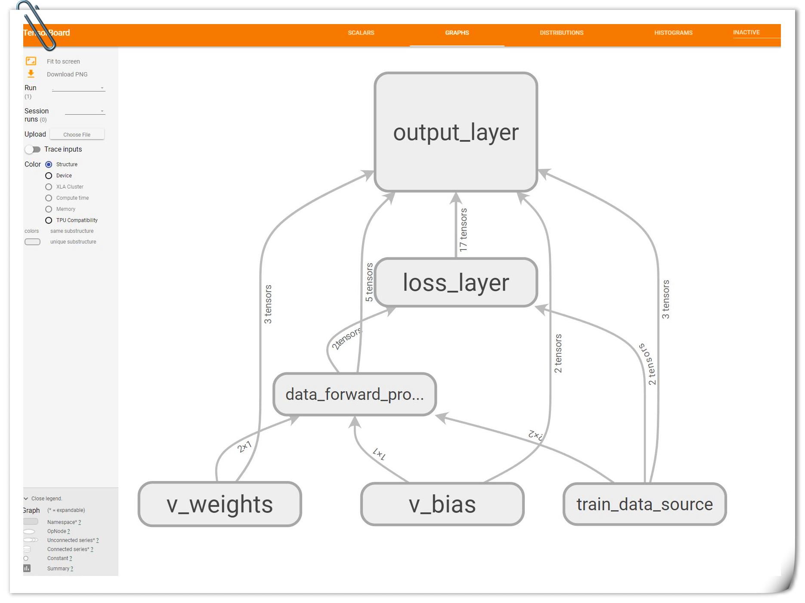

# TensorFlowPractice-LogisticRegression

## 1.Try to do LogisticRegression with TensorFlow
Run the following code to build a small graph first:
```
    py -3 TensorFlow-Logistic-Regression.py
```
Open the Tensorboard to view the graph:
```
    tensorboard --logdir=tensorlog
```
It looks like this:


