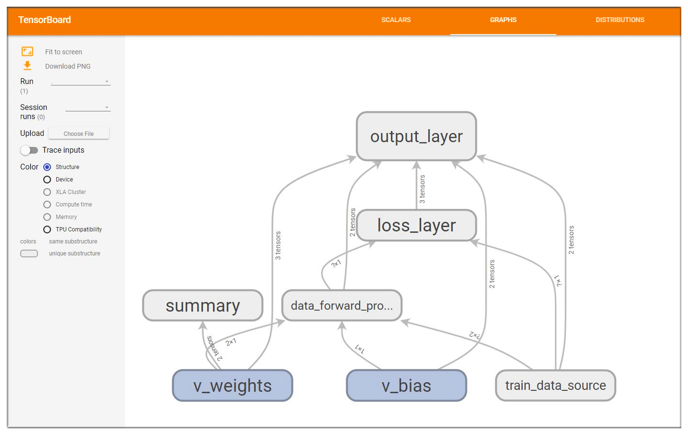

# TensorFlowPractice-LinearRegression

## 1.Try to do LinearRegression with TensorFlow
Run the following code to train first:
```
    py -3 TensorFlow-Linear_Regression.py
```
Open the Tensorboard to view the graph:
```
    tensorboard --logdir=tensorlog
```
It looks like this:


